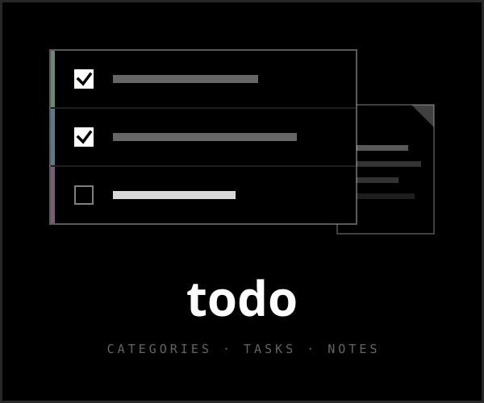

<div align="center">



# todo.justin06lee.dev

**Categories, tasks, and notes — one reference list behind one password.**<br>
*The simplest possible notion-shaped thing.*

</div>

---

Two surfaces, nothing else:

- **`/` — the board.** Categories, each with a color from the house palette,
  each holding a flat list of tasks. Add, check off, rename inline, recolor,
  clear the completed, delete. It is deliberately a *list you reference*, not a
  kanban — order is creation order and stays put.
- **`/notes` — the notes.** Named pages of markdown, like a doc without the
  ceremony. Each note opens in a split-pane editor (chrome's `editor` +
  `prose`) with two-way scroll sync; the body saves explicitly with the save
  button or cmd/ctrl+s, the title commits on blur.

The whole site sits behind the shared `ADMIN_KEY` — there is no public
surface, and every page and every mutating server action re-checks the session
itself (a layout gate has never been a boundary; see the sibling repos).

## Stack

The house seven: bun, Next.js (App Router) + React, TypeScript, Tailwind v4,
Turso/libSQL with raw SQL, motion, and [chrome](https://chrome.justin06lee.dev)
components vendored via the CLI. Dark-only, square corners, lowercase.

Data lives in the **shared Turso instance**, namespaced `todo_`:
`todo_categories`, `todo_tasks`, `todo_notes`, `todo_sessions`,
`todo_login_attempts`. The schema is bootstrapped by an idempotent, memoized
`initDb()` on the first request of a cold start — which means **running the
app migrates the database, `next dev` included**. With no `TURSO_DATABASE_URL`
the app opens `file:.data/todo.db` instead, so a fresh clone runs with no
environment at all; point the variable at `file:./scratch.db` when you want a
throwaway.

Two inherited quirks worth knowing:

- **No foreign keys are enforced** (libsql never enables the pragma), so
  deleting a category deletes its tasks in the same `db.batch`, and creating a
  task is a single `INSERT … WHERE EXISTS` so it can't orphan itself under a
  concurrent category delete.
- **Category colors are the calendar's fixed 8-hex palette** (`lib/colors.ts`),
  validated server-side — the one place this site spends color.

## Auth

The `hours.justin06lee.dev` shape, verbatim: `ADMIN_KEY` compared with a
constant-time digest compare, DB-backed sessions (sha256 of the token, never
the token), httpOnly cookie, and a harsh per-IP limiter — 10 attempts per 15
minutes, then a 24-hour lockout. Sessions are per-site even though the
password is shared. **Never add a retry loop around login.**

## Development

```bash
bun install
bun run dev        # http://localhost:3000 — uses file:.data/todo.db without env
```

Environment (`.env.example` has the names; all optional locally):

| variable | purpose |
|---|---|
| `TURSO_DATABASE_URL` | the shared Turso instance; unset → local sqlite file |
| `TURSO_AUTH_TOKEN` | its token |
| `ADMIN_KEY` | the shared master password; unset → login disabled, site still runs |

Scripts: `bun run dev`, `bun run build`, `bun run start`, `bun run lint`,
`bun run typecheck`, `bun run test` (vitest — the pure modules `lib/validate.ts`
and `lib/format-time.ts` keep their tests beside them, free of DB or env
coupling so the parts that decide correctness are testable alone).

Deploys on Vercel, default settings.
